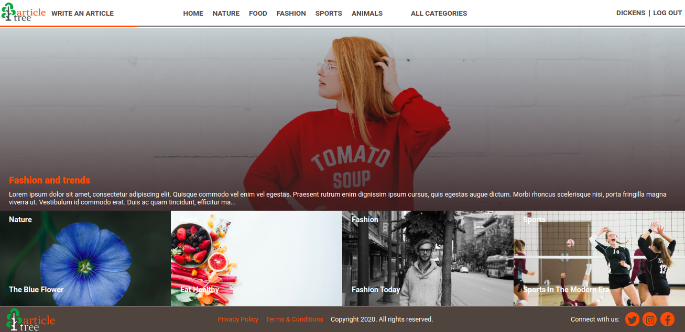
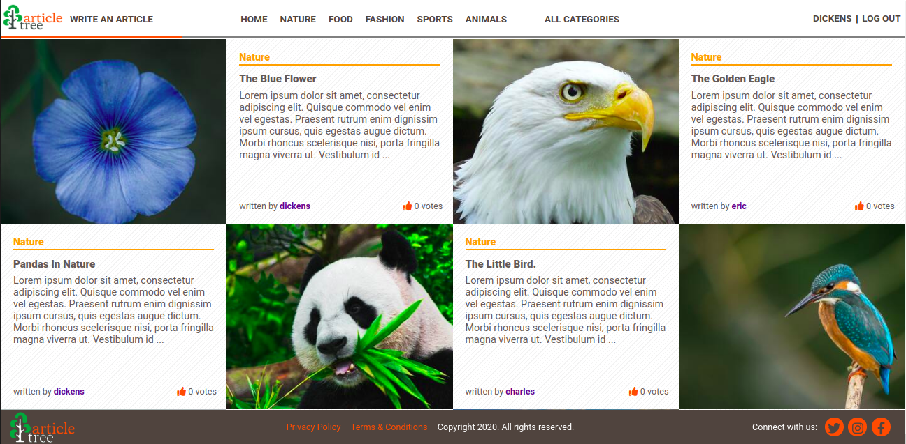
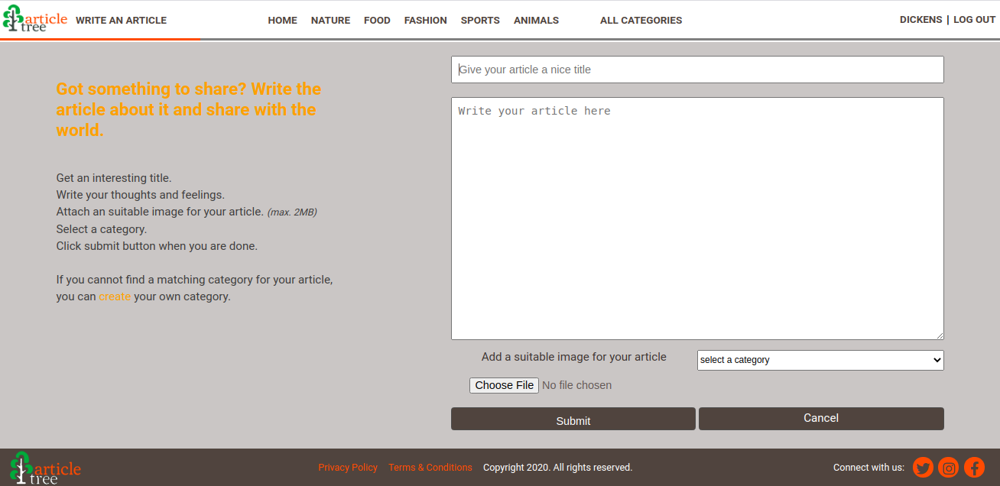

# Ruby Capstone




<!--
*** Thanks for checking out this README Template. If you have a suggestion that would
*** make this better, please fork the repo and create a pull request or simply open
*** an issue with the tag "enhancement".
*** Thanks again! Now go create something AMAZING! :D
-->

<!-- PROJECT SHIELDS -->
<!--
*** I'm using markdown "reference style" links for readability.
*** Reference links are enclosed in brackets [ ] instead of parentheses ( ).
*** See the bottom of this document for the declaration of the reference variables
*** for contributors-url, forks-url, etc. This is an optional, concise syntax you may use.
*** https://www.markdownguide.org/basic-syntax/#reference-style-links
-->
[![Contributors][contributors-shield]][contributors-url]
[![Forks][forks-shield]][forks-url]
[![Stargazers][stars-shield]][stars-url]
[![Issues][issues-shield]][issues-url]

<!-- PROJECT LOGO -->
<br />
<p align="center">
  <a href="https://github.com/praz99/ror_capstone">
  </a>

  <br />
  <a href="https://github.com/praz99/ror_capstone"><strong>Explore the docs »</strong></a>
  <br />
  <br />
  <a href="https://github.com/praz99/ror_capstone/issues">Report Bug</a>
  ·
  <a href="https://github.com/praz99/ror_capstone/issues">Request Feature</a>
</p>

<!-- TABLE OF CONTENTS -->
## Table of Contents

- [Table of Contents](#table-of-contents)
- [About The Project](#about-the-project)
- [Quick Start](#quick-start)
- [Installation](#installation)
- [Testing](#testing)
- [Built With](#built-with)
- [Contributing](#contributing)
- [Author](#author)
- [Acknowledgements](#acknowledgements)
- [📝 License](#license)

<!-- ABOUT THE PROJECT -->
## About The Project

This is the capstone project for the Ruby on Rails section of [Microverse](https://www.microverse.org/)  main curriculum. This project is based on the lifestyle articles website. In this app, users can read and write articles under vrious categories. The original design for the priject can be found [here](https://www.behance.net/gallery/14554909/liFEsTlye-Mobile-version).
<!-- ABOUT THE PROJECT -->

## Main Features of the App
* Users can create an account for which just entering an unique username is enough.
* Users can read and write articles under different categories.
* A user can read all articles without registering, however for writing an article, they must be registered users.
* A writer(author) can always edit or delete his/her article.
* Registered users can vote up (or vote down) an article which they like (or dislike).
* An article with highest number of votes is shown as the featured article on the home page of the app.

## Live demo
[Here](https://serene-reaches-80199.herokuapp.com/) is the live demo of my work.

## Built With

- Ruby version 2.7.1
- Ruby on Rails version 6.0.3

## Quick Start

### Prerequisite
* Install Ruby ([installation guide](https://www.ruby-lang.org/en/documentation/installation/))
* Install Ruby on Rails ([installation guide](https://guides.rubyonrails.org/getting_started.html#creating-a-new-rails-project-installing-rails))
* Git and Github

#### Get a local copy with:<br>
```js
git clone https://github.com/praz99/ror_capstone.git
```

### Installation

After cloning the app, enter following commands in your terminal.
```js
bundle install
```
```js
rails db:migrate
```
Open https://localhost:3000/ in your browser

### Testing

To test the project

- Navigate to the directory where the project is located.
- Open terminal in this directory.
- Start testing by using `rspec` command.

## Contributing
Contributions, issues and feature requests are welcome! Start by:
* Fork the project.
* Clone the project to your local machine.
* `cd` into the project directory.
* Run `git checkout -b your-branch-name`.
* Make your contributions.
* Push your branch up to your forked repository.
* Open a Pull Request with a detailed description to the development branch of the original project for a review.
<!-- CONTACT -->
## Author

👤 **Prajwal Thapa** 
    
- LinkedIn: [Prazwalthapa](www.linkedin.com/in/prazwal-thapa/) 
- GitHub: [@praz99](https://github.com/praz99)
- E-mail: t.prazwal@gmail.com

## Show your support

Give a ⭐️ if you like this project!

<!-- ACKNOWLEDGEMENTS -->
## Acknowledgements
* [Nelson Sakwa](https://www.behance.net/sakwadesignstudio)
* [Microverse](https://www.microverse.org/)

<!-- MARKDOWN LINKS & IMAGES -->
<!-- https://www.markdownguide.org/basic-syntax/#reference-style-links -->
[contributors-shield]: https://img.shields.io/github/contributors/praz99/ruby_capstone.svg?style=flat-square
[contributors-url]: https://github.com/praz99/ruby_capstone/graphs/contributors
[forks-shield]: https://img.shields.io/github/forks/praz99/ruby_tic_tac_toe.svg?style=flat-square
[forks-url]: https://github.com/praz99/ruby_capstone/network/members
[stars-shield]: https://img.shields.io/github/stars/praz99/ruby_tic_tac_toe.svg?style=flat-square
[stars-url]: https://github.com/praz99/ruby_capstone/stargazers
[issues-shield]: https://img.shields.io/github/issues/praz99/ruby_tic_tac_toe.svg?style=flat-square
[issues-url]: https://github.com/praz99/ruby_capstone/issues

## License
- This project is MIT licensed.